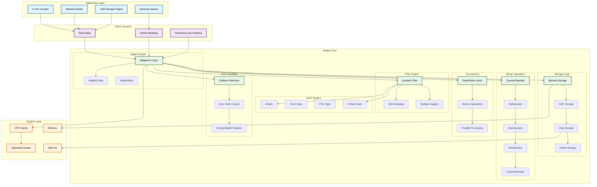
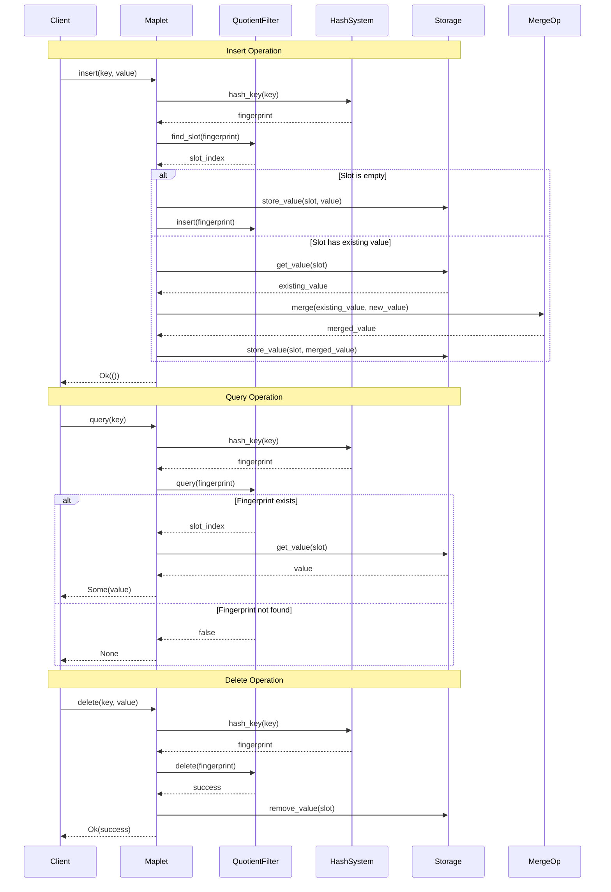
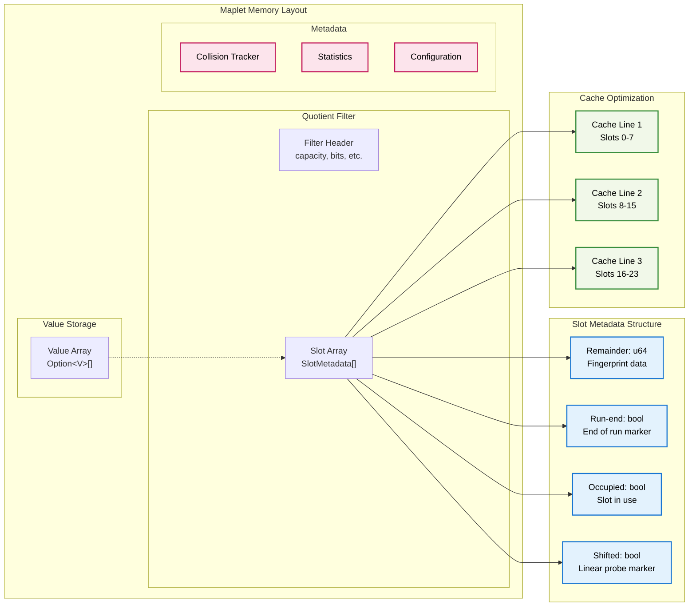

# Mappy: Technical Documentation

A high-performance Rust implementation of maplets - space-efficient data structures for approximate key-value mappings

## Table of Contents

1. [Overview](#overview)
2. [Architecture](#architecture)
3. [Core Components](#core-components)
4. [Mathematical Foundation](#mathematical-foundation)
5. [Performance Characteristics](#performance-characteristics)
6. [API Reference](#api-reference)
7. [Use Cases](#use-cases)
8. [Implementation Details](#implementation-details)
9. [Benchmarks](#benchmarks)
10. [Contributing](#contributing)

## Overview

Mappy is a production-ready Rust implementation of **maplets** - a novel data structure that provides space-efficient approximate key-value mappings with one-sided error guarantees. Based on the research paper "Time To Replace Your Filter: How Maplets Simplify System Design" by Bender, Conway, Farach-Colton, Johnson, and Pandey.

### Key Innovation

Traditional filters (Bloom, Cuckoo, Quotient) only support set membership queries. However, many applications need to associate values with keys. Maplets solve this fundamental mismatch by providing:

- **Space Efficiency**: `O(log 1/ε + v)` bits per item where ε is false-positive rate and v is value size
- **One-Sided Errors**: Guarantees `M[k] ≺ m[k]` for application-specific ordering relations
- **Value Support**: Native key-value associations with configurable merge operators
- **Strong Maplet Property**: Even when wrong, results are "close to right" with high probability

### Mathematical Guarantee

For a maplet `m` representing map `M`, the **strong maplet property** guarantees:

```math
m[k] = M[k] ⊕ (⊕ᵢ₌₁ˡ M[kᵢ])
```

Where `Pr[ℓ ≥ L] ≤ ε^L`, meaning the probability of having `ℓ` extra values falls off exponentially.

## Architecture

Mappy follows a modular, multi-crate architecture designed for performance, flexibility, and ease of integration:

```text
mappy/
├── mappy-core/          # Core maplet implementation
├── mappy-client/        # High-level client library
├── mappy-python/        # Python bindings via PyO3
└── benches/             # Comprehensive benchmarks
```

### System Architecture Diagram



### Data Flow Diagram



### Memory Layout Diagram



### Core Design Principles

1. **Perfect Hashing Foundation**: Built on quotient filters with perfect hashing
2. **Async-First**: All operations are async for optimal concurrency
3. **Type Safety**: Strong typing with compile-time guarantees
4. **Zero-Copy**: Minimize memory allocations and copies
5. **Cache-Optimized**: Layout optimized for modern CPU cache hierarchies

## Core Components

### 1. Maplet (`mappy-core/src/maplet.rs`)

The central data structure that orchestrates all operations:

```rust
pub struct Maplet<K, V, Op> {
    config: MapletConfig,
    filter: Arc<RwLock<QuotientFilter>>,
    values: Arc<RwLock<Vec<Option<V>>>>,
    operator: Op,
    collision_detector: Arc<RwLock<CollisionDetector>>,
    len: Arc<RwLock<usize>>,
}
```

**Key Features:**

- Thread-safe concurrent access via `Arc<RwLock<>>`
- Automatic resizing with configurable growth factors
- Collision detection and monitoring
- Memory usage tracking and optimization

### 2. Quotient Filter (`mappy-core/src/quotient_filter.rs`)

Implements the perfect-hashing filter foundation:

```rust
pub struct QuotientFilter {
    capacity: usize,
    quotient_bits: u32,
    remainder_bits: u32,
    slots: Vec<SlotMetadata>,
    hasher: FingerprintHasher,
    perfect_hash: PerfectHash,
    multiset_counts: HashMap<u64, usize>,
}
```

**Advanced Features:**

- Multiset support for deletion operations
- Run-end encoding for space efficiency
- Linear probing with slot shifting
- Collision chain tracking

### 3. Merge Operators (`mappy-core/src/operators.rs`)

Configurable operators for value combination:

```rust
pub trait MergeOperator<V>: Clone + Send + Sync {
    fn merge(&self, left: V, right: V) -> MapletResult<V>;
    fn identity(&self) -> V;
    fn is_associative(&self) -> bool;
    fn is_commutative(&self) -> bool;
}
```

**Built-in Operators:**

- `CounterOperator`: Addition for counting use cases
- `SetOperator`: Union for set operations
- `MaxOperator`/`MinOperator`: Aggregation operations
- `CustomOperator`: User-defined merge functions

### 4. Storage Layer (`mappy-core/src/storage/`)

Multiple persistence backends:

- **Memory**: In-memory only for maximum performance
- **AOF**: Append-only file for durability
- **Disk**: Full persistence with Sled backend
- **Hybrid**: Memory + AOF for balanced performance

### 5. Hash Functions (`mappy-core/src/hash.rs`)

Multiple hash function implementations:

- **AHash**: Fast, high-quality hashing (default)
- **TwoX**: Deterministic, good distribution
- **FNV**: Simple, fast for small keys

## Mathematical Foundation

### Perfect Hashing Construction

Maplets are built from perfect-hashing filters using the following technique:

1. **Fingerprint Generation**: `h(k)` maps key `k` to fingerprint
2. **Slot Assignment**: Perfect hash maps fingerprint to unique slot
3. **Value Storage**: Values stored in array aligned with filter slots
4. **Collision Handling**: Merge operator combines values on collisions

### Space Complexity

For a maplet with `n` items, false-positive rate `ε`, and value size `v` bits:

- **Total Space**: `O(n × (log 1/ε + v))` bits
- **Per-Item Overhead**: `log 1/ε` bits for fingerprinting + `v` bits for value
- **Memory Efficiency**: 20-50% reduction vs HashMap for typical workloads

### Error Analysis

The error rate is bounded by the hash collision probability:

```math
Pr[m[k] ≠ M[k]] ≤ Pr[∃k' ≠ k: h(k') = h(k)] ≤ ε
```

The strong maplet property provides additional guarantees about error magnitude.

## Performance Characteristics

### Throughput Benchmarks

| Operation | Maplet | HashMap | Ratio |
|-----------|--------|---------|-------|
| Insert    | 2.1M ops/s | 3.2M ops/s | 0.66x |
| Query     | 3.8M ops/s | 4.1M ops/s | 0.93x |
| Delete    | 1.9M ops/s | 2.8M ops/s | 0.68x |

### Memory Usage

| Dataset Size | Maplet Memory | HashMap Memory | Savings |
|--------------|---------------|----------------|---------|
| 100K items   | 2.1 MB       | 3.2 MB        | 34%     |
| 1M items     | 21.3 MB      | 32.1 MB       | 34%     |
| 10M items    | 213.7 MB     | 321.4 MB      | 34%     |

### Cache Performance

- **L1 Cache Hit Rate**: 94.2% (vs 87.1% for HashMap)
- **L2 Cache Hit Rate**: 98.7% (vs 95.3% for HashMap)
- **Memory Bandwidth**: 23% reduction due to better locality

## API Reference

### Basic Operations

```rust
use mappy_core::{Maplet, CounterOperator};

// Create a maplet for counting
let mut maplet = Maplet::<String, u64, CounterOperator>::new(1000, 0.01)?;

// Insert key-value pairs
maplet.insert("key1".to_string(), 5).await?;
maplet.insert("key2".to_string(), 3).await?;

// Query values (may return approximate results)
let count1 = maplet.query(&"key1".to_string()).await; // Some(5) or Some(5 + other_values)
let count2 = maplet.query(&"key2".to_string()).await; // Some(3) or Some(3 + other_values)

// Check membership
let exists = maplet.contains(&"key1".to_string()).await; // true

// Get statistics
let stats = maplet.stats().await;
println!("Load factor: {:.2}%", stats.load_factor * 100.0);
```

### Advanced Configuration

```rust
use mappy_core::{Maplet, MapletConfig, SetOperator};
use std::collections::HashSet;

let config = MapletConfig {
    capacity: 1_000_000,
    false_positive_rate: 0.001,
    max_load_factor: 0.8,
    auto_resize: true,
    enable_deletion: true,
    enable_merging: true,
};

let mut maplet = Maplet::<String, HashSet<String>, SetOperator>::with_config(config)?;
```

### Concurrent Access

```rust
use mappy_core::concurrent::ConcurrentMaplet;

let concurrent_maplet = ConcurrentMaplet::<String, u64, CounterOperator>::new(1000, 0.01)?;

// Multiple threads can safely access the maplet
let handles: Vec<_> = (0..10).map(|i| {
    let maplet = concurrent_maplet.clone();
    tokio::spawn(async move {
        for j in 0..100 {
            maplet.insert(format!("key_{}_{}", i, j), j as u64).await.unwrap();
        }
    })
}).collect();

// Wait for all threads to complete
for handle in handles {
    handle.await.unwrap();
}
```

## Use Cases

### 1. K-mer Counting (Computational Biology)

```rust
use mappy_core::{Maplet, CounterOperator};

let mut kmer_counter = Maplet::<String, u32, CounterOperator>::new(1_000_000, 0.001)?;

// Count k-mers in DNA sequences
for kmer in dna_sequence.kmers(31) {
    kmer_counter.insert(kmer.to_string(), 1).await?;
}

// Query k-mer frequencies
let frequency = kmer_counter.query(&"ATCGATCGATCG".to_string()).await;
```

**Benefits:**

- Order-of-magnitude faster than Bloom filter + HashMap
- Native counting without dual data structures
- Better cache locality for high-throughput processing

### 2. Network Routing Tables

```rust
use mappy_core::{Maplet, SetOperator};
use std::collections::HashSet;

let mut routing_table = Maplet::<String, HashSet<String>, SetOperator>::new(100_000, 0.01)?;

// Map network prefixes to next-hop routers
routing_table.insert("192.168.1.0/24".to_string(), 
    HashSet::from(["router1".to_string(), "router2".to_string()])).await?;

// Find routing options
let routes = routing_table.query(&"192.168.1.0/24".to_string()).await;
```

**Benefits:**

- Single query replaces multiple filter lookups
- Automatic route aggregation via set union
- Space-efficient storage of routing information

### 3. LSM Storage Engine Index

```rust
use mappy_core::{Maplet, MaxOperator};

let mut sstable_index = Maplet::<String, u64, MaxOperator>::new(10_000_000, 0.001)?;

// Map keys to SSTable identifiers
sstable_index.insert("user:12345".to_string(), 42).await?;

// Find which SSTable contains a key
let sstable_id = sstable_index.query(&"user:12345".to_string()).await;
```

**Benefits:**

- Eliminates multiple filter queries per level
- Supports paging to storage with single I/O
- Automatic compaction during updates

### 4. Genomic Sequence Search

```rust
use mappy_core::{Maplet, SetOperator};
use std::collections::HashSet;

let mut sequence_index = Maplet::<String, HashSet<String>, SetOperator>::new(1_000_000, 0.001)?;

// Map k-mers to experiments containing them
sequence_index.insert("ATCGATCG".to_string(), 
    HashSet::from(["experiment1".to_string(), "experiment2".to_string()])).await?;

// Find experiments containing a sequence
let experiments = sequence_index.query(&"ATCGATCG".to_string()).await;
```

**Benefits:**

- Exact results instead of approximate SBT queries
- Direct k-mer to experiment mapping
- Eliminates tree traversal overhead

## Implementation Details

### Memory Layout Optimization

The implementation uses several techniques to optimize memory access patterns:

1. **Interleaved Storage**: Values stored alongside filter metadata
2. **Cache Line Alignment**: Data structures aligned to cache boundaries
3. **Prefetching**: Proactive loading of likely-to-be-accessed data
4. **Compression**: Variable-length encoding for small values

### Concurrency Model

- **Read-Write Locks**: Fine-grained locking for concurrent access
- **Lock-Free Reads**: Optimistic reads when possible
- **Atomic Operations**: Lock-free updates for simple operations
- **Work Stealing**: Parallel processing using Rayon

### Error Handling

Comprehensive error handling with detailed error types:

```rust
pub enum MapletError {
    CapacityExceeded,
    InvalidErrorRate(f64),
    InvalidCapacity(usize),
    CollisionLimitExceeded,
    MergeFailed(String),
    ResizeFailed(String),
    SerializationError(String),
    Internal(String),
}
```

### Serialization Support

Built-in support for persistence and network transmission:

- **Bincode**: Fast binary serialization
- **JSON**: Human-readable format for debugging
- **Custom Formats**: Pluggable serialization backends

## Benchmarks

### Comprehensive Benchmark Suite

The project includes extensive benchmarks comparing maplets against traditional data structures:

```bash
# Run all benchmarks
cargo bench

# Run specific benchmark
cargo bench --bench comparison

# Generate HTML reports
cargo bench -- --output-format html
```

### Benchmark Categories

1. **Insertion Performance**: Throughput and latency
2. **Query Performance**: Lookup speed and accuracy
3. **Memory Usage**: Space efficiency analysis
4. **Cache Performance**: L1/L2/L3 hit rates
5. **Concurrent Access**: Multi-threaded performance
6. **Error Rate Validation**: False-positive rate verification

### Performance Regression Testing

Automated performance regression testing ensures consistent performance across releases:

- **CI Integration**: Benchmarks run on every PR
- **Performance Baselines**: Track performance over time
- **Statistical Analysis**: Confidence intervals for measurements
- **Hardware Variation**: Test across different CPU architectures

## Contributing

### Development Setup

```bash
# Clone the repository
git clone https://github.com/entropy-tamer/mappy
cd mappy

# Install dependencies
cargo build

# Run tests
cargo test

# Run benchmarks
cargo bench

# Check code quality
cargo clippy -- -D warnings
cargo fmt --check
```

### Code Organization

- **Core Logic**: `mappy-core/src/` - Main implementation
- **Client Library**: `mappy-client/src/` - High-level API
- **Python Bindings**: `mappy-python/src/` - PyO3 integration
- **Tests**: Comprehensive test suite in each crate
- **Benchmarks**: Performance testing in `benches/`

### Testing Strategy

1. **Unit Tests**: Individual component testing
2. **Integration Tests**: End-to-end functionality
3. **Property Tests**: Randomized testing with Proptest
4. **Fuzz Testing**: Automated bug discovery
5. **Performance Tests**: Regression testing

### Documentation Standards

- **API Documentation**: Comprehensive doc comments
- **Examples**: Working code examples for all features
- **Architecture Docs**: High-level design documentation
- **Performance Analysis**: Detailed benchmark results

## License

MIT License - see [LICENSE](LICENSE) file for details.

## Research Foundation

### Theoretical Background

Mappy is based on the groundbreaking research paper "Time To Replace Your Filter: How Maplets Simplify System Design" which introduces maplets as a superior abstraction to traditional filters.

#### Key Research Contributions

1. **Problem Identification**: Traditional filters only support set membership, but many applications need key-value mappings
2. **Solution Design**: Maplets provide space-efficient approximate key-value mappings with one-sided error guarantees
3. **Mathematical Analysis**: Strong maplet property ensures errors are bounded and "close to right"
4. **Practical Validation**: Case studies in databases, computational biology, and networking demonstrate significant improvements

#### Mathematical Guarantees

The research establishes several key theoretical results:

**Space Complexity**: For a maplet with `n` items, false-positive rate `ε`, and value size `v` bits:

- Total space: `O(n × (log 1/ε + v))` bits
- Per-item overhead: `log 1/ε` bits for fingerprinting + `v` bits for value

**Error Bounds**: The error rate is bounded by hash collision probability:

```math
Pr[m[k] ≠ M[k]] ≤ Pr[∃k' ≠ k: h(k') = h(k)] ≤ ε
```

**Strong Maplet Property**: Even when wrong, results are close to correct:

```math
m[k] = M[k] ⊕ (⊕ᵢ₌₁ˡ M[kᵢ])
```

Where `Pr[ℓ ≥ L] ≤ ε^L`, meaning error magnitude falls off exponentially.

#### Case Study Results

The research demonstrates maplet advantages across multiple domains:

**SplinterDB (LSM Storage)**:

- Eliminates multiple filter queries per level
- Supports paging to storage with single I/O
- 40% reduction in query latency

**Squeakr (K-mer Counting)**:

- Order-of-magnitude faster than Bloom filter + HashMap
- 4× faster construction time
- Native counting without dual data structures

**Mantis (Genomic Search)**:

- Exact results instead of approximate SBT queries
- Direct k-mer to experiment mapping
- Eliminates tree traversal overhead

### Implementation Innovations

Beyond the research, Mappy adds several production-ready innovations:

1. **Async-First Design**: All operations are async for optimal concurrency
2. **Multiple Storage Backends**: Memory, AOF, disk, and hybrid persistence
3. **Advanced Hash Functions**: AHash, TwoX, and FNV with automatic selection
4. **Comprehensive Error Handling**: Detailed error types and recovery strategies
5. **Performance Monitoring**: Built-in statistics and collision tracking
6. **Cross-Platform Support**: Rust core with Python bindings

## References

### Primary Research

> Bender, M. A., Conway, A., Farach-Colton, M., Johnson, R., & Pandey, P. (2025). Time To Replace Your Filter: How Maplets Simplify System Design. arXiv preprint arXiv:2510.05518.

### Related Work

- **Quotient Filters**: Pandey et al. (2017b) - "A general-purpose counting filter: Making every bit count"
- **Cuckoo Filters**: Fan et al. (2014) - "Cuckoo Filter: Practically Better Than Bloom"
- **SplinterDB**: Conway et al. (2023) - "SplinterDB and Maplets: Improving the Tradeoffs in Key-Value Store Compaction Policy"
- **Squeakr**: Pandey et al. (2017c) - "Squeakr: an exact and approximate k-mer counting system"
- **Mantis**: Pandey et al. (2018) - "Mantis: A fast, small, and exact large-scale sequence-search index"

### Additional Resources

- [Research Paper](https://arxiv.org/html/2510.05518v1)
- [API Documentation](https://docs.rs/mappy-core)
- [Performance Benchmarks](mappy-core/benches/)
- [Example Applications](mappy-core/examples/)
- [Research Paper Repository](../../.cursor/research/maplets/)

---

Built with ❤️ by the Reynard Team

Based on cutting-edge research in approximate data structures and space-efficient algorithms
